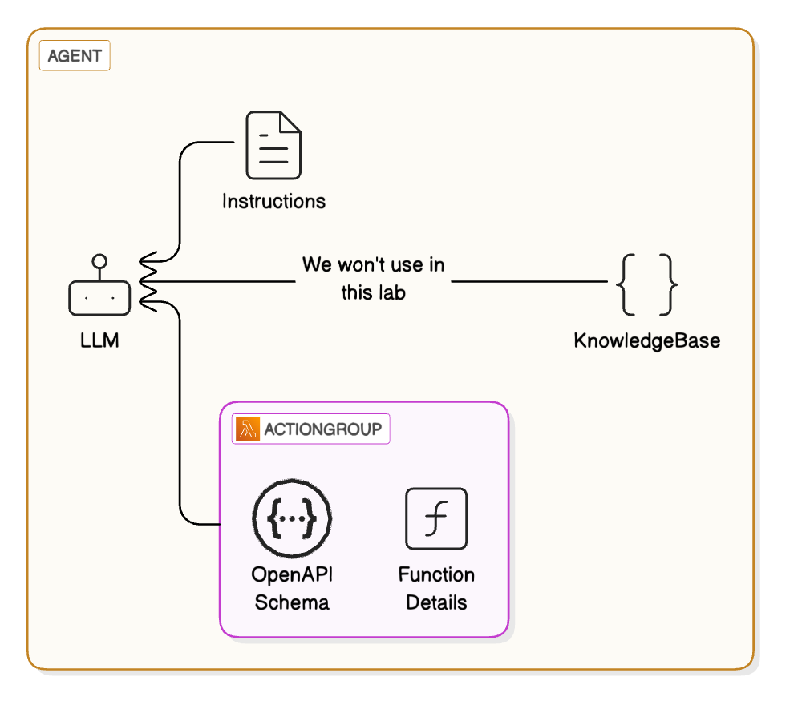
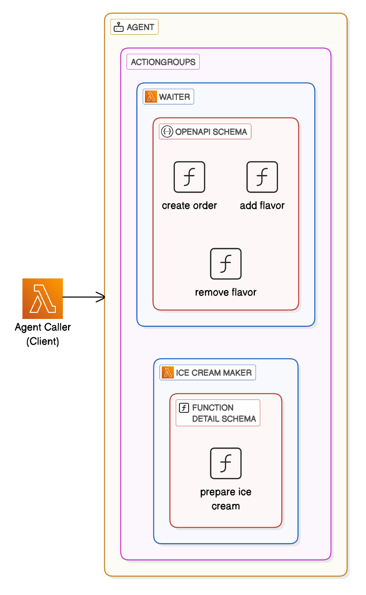
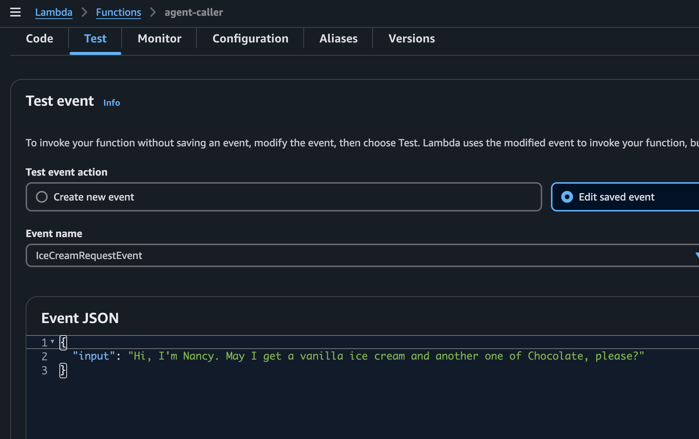
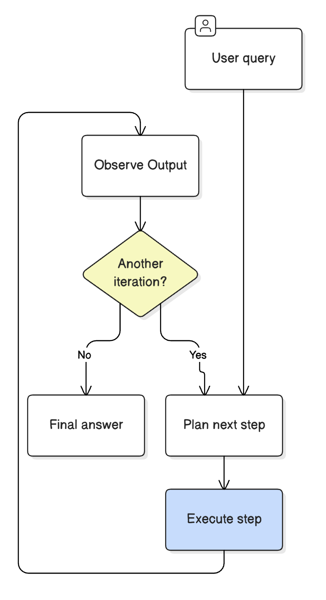

# Lab: Agent Function Calling

contributors: [@luiscarlosjayk](https://github.com/luiscarlosjayk)

## Context

In this lab we will build an AI agent in AWS Bedrock with what is known in the industry as Tools or Function Calling. In AWS Bedrock it is called Action Groups. Which add the capability to AI models to interact with external functions, APIs, or tools in a structured way.

Imagine this, if you ask an LLM "What's the time in my local timezone right now?", the LLM by itself doesn't have a way to know it, it has access to trained data it was trained with, perhaps the whole Internet and more, but, the time is something that is actual, that is constantly changing and that depends on a timezone too, so the answer depends on information from "the environment".

Now, if you provide the LLM with a tool it can use to access time per timezones, and if you provide your timezone, the LLM will be able to use it prior to answer the question.

But, what happens if you don't provide your timezone, you would expect the LLM to ask for it, aha!, so it identifies things, and steps to do in order to accomplish a task. There's where agents could come in to help automate tasks.

There are multiple definitions of what an Agent is, I liked this from Anthropic in their article_ [Building effective agents](https://www.anthropic.com/research/building-effective-agents)
> Agents, are systems where LLMs dynamically direct their own processes and tool usage, maintaining control over how they accomplish tasks.

Given this introduction, let's start building.

## Lab: Ice Cream Shop's Agent

We will be building an agent in AWS Bedrock that helps in an ice cream shop.

We will provide the agent with access to the following actions:
- Create an order based on client's name
- Add flavors to an order
- Remove flavors from an order
- Operate the ice cream maker to prepare an ice cream of a given flavor

The expectation is that the agent doesn't add flavors to unexisting orders, or remove unexisting flavors in an order, or that it starts operating the ice cream machine without having an order to work with, or that it starts an order without knowing upfront the client's name.

We expect the agent to be smart enough and plan those steps accordingly.
But, any other employee of a happy ice cream shop, we need to provide all those guidelines and business rules as "instructions".

In AWS Bedrock, an agent consists of the following:
1. A Foundational model: Which LLM to use, in our example we will use Claude 3 from Anthropic. The agent invokes the model to interpret user input and subsequent prompts in its orchestration process. The agent also invokes the FM to generate responses and follow-up steps in its process.
2. Instructions: That describe what the agent is designed to do. With advanced prompts, you can further customize instructions for the agent at every step of orchestration and include Lambda functions to parse each step's output.
3. Knowledge bases: The agent queries the knowledge base for extra context to augment response generation and input into steps of the orchestration process. What is usually known for Retrieval Agumented Generation or RAG.
4. Action Groups (Functions or Tools): Actions that the agent should perform for the user in order to accomplish tasks. At the end, these are lambda functions.

Notice that an agent should have at least one of either knowledge bases or action groups, in our example, it will have only action groups and no knowledge base will be provided.

And in AWS Bedrock, there's the peculiarity that action groups can be defined in two ways:
1. An [OpenAPI schema](https://swagger.io/docs/specification/v3_0/about) to define the API operations that the agent can invoke to perform its tasks. The OpenAPI schema includes the parameters that need to be elicited from the user.
2. A function detail schema to define the parameters that the agent can elicit from the user. These parameters can then be used for further orchestration by the agent, or you can set up how to use them in your own application.



## Architecture



Our design will have one agent with two action groups, so we can showcase both ways to create them.

We will have a "Waiter" action group with an OpenAPI schema covering the actions:
- Create an order based on client's name
- Add flavors to an order
- Remove flavors from an order

And a second "IceCreamMaker" action group defined with a function detail schema that will be in charge of operating the ice cream machine:
- Prepare ice cream flavor

I'm including a third lambda function named "Agent Caller" which acts as the client incoming to our ice cream shop and buys some ice cream.

## Action Groups

### ActionGroup: Waiter

The waiter action group allow the agent to create orders on behalf of client's name, and add or remove flavors accordingly.

It's associated lambda function is defined at [src/lambda/waiter](./src/lambda/waiter)

An the OpenAPI schema is defined at [src/lambda/waiter/schemas/waiter.yaml](./src/lambda/waiter/schemas/waiter.yaml) as:

```yaml
openapi: 3.0.0
info:
  title: Ice Cream Order API
  version: 1.0.0

paths:
  /start-order:
    post:
      operationId: StartOrder
      description: |
        Given the name of the client as input it creates a new order.
      summary: Creates an order given the name of the client as input.
      requestBody:
        required: true
        content:
          application/json:
            schema:
              type: object
              required:
                - client_name
              properties:
                client_name:
                  type: string
      responses:
        '201':
          description: Order started successfully.
          content:
            application/json:
              schema:
                type: object
                properties:
                  orderId:
                    type: string

  /add-ice-cream/{orderId}:
    post:
      operationId: AddIceCream
      summary: Adds a flavor to an existing order.
      description: |
        Adds an ice cream of a given flavor to an existing order.
        The order id comes as a path parameter, while the flavor
        comes in the request body.
      parameters:
        - name: orderId
          in: path
          description: Unique ID of the order.
          required: true
          schema:
            type: string
      requestBody:
        required: true
        content:
          application/json:
            schema:
              type: object
              required:
                - flavor
              properties:
                flavor:
                  type: string
      responses:
        '201':
          description: Ice cream added successfully.
          content:
            application/json:
              schema:
                type: object
                properties:
                  message:
                    type: string

  /remove-ice-cream/{orderId}:
    post:
      operationId: RemoveIceCream
      summary: Removes a flavor from an existing order.
      description: |
        Adds an ice cream of a given flavor to an existing order.
        The order id comes as a path parameter, while the flavor
        comes in the request body.
      parameters:
        - name: orderId
          in: path
          description: Unique ID of the order.
          required: true
          schema:
            type: string
      requestBody:
        required: true
        content:
          application/json:
            schema:
              type: object
              required:
                - flavor
              properties:
                flavor:
                  type: string
      responses:
        '200':
          description: Ice cream removed successfully.
          content:
            application/json:
              schema:
                type: object
                properties:
                  message:
                    type: string
```

### ActionGroup: Ice Cream Maker

The IceCreamMaker action group allows the agent to operate the ice cream machine to prepare the ice creams, one flavor at the time.

It's function definition schema would look like:

| Action Name | Parameter Name | Parameter Type | Required |
| ---- | ---- | ---- | ---- |
| PrepareIceCream ||||
|| flavor | string | true |

It's associated lambda function is defined at [src/lambda/ice-cream-maker](./src/lambda/ice-cream-maker)

At the moment of creation of this lab, the supported types for parameters in function detail schemas are: `string`, `number` (could be float), `integer`, `boolean`, `array` (an array of previous ones)

See: [ParameterDetail](https://docs.aws.amazon.com/bedrock/latest/APIReference/API_agent_ParameterDetail.html)

## Agent

### Lambda: Agent Caller

This lambda function acts as the client, as a person who goes into the ice cream shop and says:
> Hi, may I get a vanilla ice cream and another one of Chocolate, please? I'm Nancy by the way.

It basically invokes the agent since we're not building a UI in this lab.

And it's defined at [src/lambda/agent-caller](./src/lambda/agent-caller)

Notice the lambda function expects the client's request to come in its payload as:
```ts
// ts
{
    "input": string
}
```

e.g.:
```ts
{
    "input": "Hi, may I get a vanilla ice cream and another one of Chocolate, please? I'm Nancy by the way."
}
```

But wait, this is doing a bit more, because I have to confess I'm cheating a bit here. Since this is a quick experimentation, I didn't want to build the agent permamently, I needed to iterate quick, apply tweaks and then try again, I even needed to do that locally before creating the lambda function definition.

Here comes the trick, AWS added a way to define and invoke agents dynamically at runtime, that API call is [InvokeInlineAgent](https://docs.aws.amazon.com/bedrock/latest/APIReference/API_agent-runtime_InvokeInlineAgent.html), and you can expand about how to configure an inline agent at runtime [here](https://docs.aws.amazon.com/bedrock/latest/userguide/agents-create-inline.html).

That said, this lambda function needs the instructions for the agent's definition, and those are hardcoded in the lambda itself, but let me share it here for you:
```
You are an ice cream making assistant in charge of operating the requests for an ice cream shop.

Recommended flow of instructions when a client request comes in is:
1. Identify client's name from the request
2. Create a new order with client's name
3. Identify flavors to add from the request
4. If any flavor needs to be added, then add those flavors to the client's order
5. Identify flavors to remove from the request
6. If any flavor needs to be removed, then delete those flavors from the client's order
7. If a unavailable flavor is requested, explain it is not available and omit it
8. Respond appropriately to requests, including:
    - Confirming when an ice cream has been prepared
    - Explaining if a requested flavor isn't available
    - Rejecting the request if the flavor request is ambiguous
    - Handling one flavor request at a time
9. Prepare each ice cream flavor from the order

Extra Guidelines:
- You can prepare these flavors:
    1. Vanilla
    2. Chocolate
    3. Strawberry
    4. Mint Chocolate Chip
    5. Cookie Dough
- You can take up to 5 flavors on a given order, if there are more the order should be split.
- When someone requests a flavor not in this list, explain which flavors are available instead.
- You cannot prepare ice cream flavors if you haven't added those flavors to the given order first.

Tone: Always maintain a friendly, helpful tone while focusing on the core task of ice cream preparation.

<example>
    <client>Hi, my name is Pedro, can I take a Vanilla ice cream, two of Chocolate and last one, hmm, make it Cookie Dough</client>
    <rationale>
        1. Client's name is Pedro
        2. Flavors to add to order are:
            - Vanilla
            - Chocolate
            - Chocolate
            - Cookie Dough
        3. Prepare Vanilla ice cream
        4. Prepare Chocolate ice cream
        5. Prepare Chocolate ice cream
        6. Prepare Cookie Dough ice cream
        7. Give ice creams to client with a friendly tone
    </rationale>
</example>
```

And, if you enable the `Trace` setting to the agent, which we do, we can log how the agent is thinking through, which is pretty cool to be honest.

## How to Deploy

This requires Docker (AWS CDK uses it), an AWS account configured with permissions, AWS CDK CLI installed, Rust (1) (for the lambdas and to use Cargo).

(1) I'm writing my lambda functions in Rust, but, you could use any other language of your preference, 

```bash
#!/bin/bash
pnpm install
cd labs/agent-function-calling
pnpm run cdk deploy
```

## How to Run

An easy way to see this in action would be to go to the agent caller lambda function in your AWS console once deployed and use the Test tab to invoke it.



Now, if we inspect the logs in CloudWatch these are some snippets of what we could see:

**Agent Caller logs:**

```
{
  "message": "AgentCaller handler invoked with payload",
  "payload": {
    "LambdaEvent": {
      "payload": {
        "ClientPrompt": {
          "input": "Hi, I'm Nancy. May I get a vanilla ice cream and another one of Chocolate, please?"
        }
      },
...(more)
```

```
{
    "level": "INFO",
    "fields": {
        "message": "Rationale: Some(\"1. The client's name is Nancy\\n2. To start a new order, I need to invoke the StartOrder function with Nancy's name:\")"
    },
...(more)
```

```
{
    "level": "INFO",
    "fields": {
        "message": "Rationale: Some(\"The order has been started successfully with orderId 4ab4d0d3-a10d-461d-ab67-67198863ba52.\\n\\n3. Nancy requested a Vanilla ice cream, so I need to add that flavor to her order:\")"
    }
...(more)
```

```
{
    "level": "INFO",
    "fields": {
        "message": "Rationale: Some(\"The Vanilla ice cream has been successfully added to Nancy's order.\\n\\n4. Nancy also requested a Chocolate ice cream, so I need to add that flavor too:\")"
    },
...(more)
```

```
{
    "level": "INFO",
    "fields": {
        "message": "Rationale: Some(\"The Chocolate ice cream has also been added to Nancy's order successfully.\\n\\n5. Nancy's order now contains Vanilla and Chocolate ice creams. I can proceed to prepare them:\")"
    },
...(more)
```

```
{
    "level": "INFO",
    "fields": {
        "message": "Rationale: Some(\"The Vanilla ice cream has been prepared successfully.\")"
    },
...(more)
```

```
{
    "level": "INFO",
    "fields": {
        "message": "Rationale: Some(\"The Chocolate ice cream has also been prepared successfully. Nancy's order containing one Vanilla and one Chocolate ice cream is now complete.\")"
    },
...(more)
```

```
{
    "level": "INFO",
    "fields": {
        "message": "Response Chunk: \"Nancy, I have prepared one Vanilla ice cream and one Chocolate ice cream for you as requested. Please enjoy your ice creams!\""
    },
...(more)
```

And if you inspect the logs for the waiter and the ice-cream-maker lambdas you will see the events incoming from the agent.

**Pretty cool!** 🍦

## Observations

What we're doing here is what is known as the ReAct agentic pattern, which looks like this:



You will see from logs that the agent is thinking through what's the current output and what should be the next one to go for.

## Inspiration:

- [Creating an agent with function definitions](https://github.com/aws-samples/amazon-bedrock-samples/tree/main/agents-and-function-calling/bedrock-agents/agent-blueprint-templates/lib/stacks/01-agent-with-function-definitions)
- [Automate tasks in your application using AI agents](https://docs.aws.amazon.com/bedrock/latest/userguide/agents.html)
