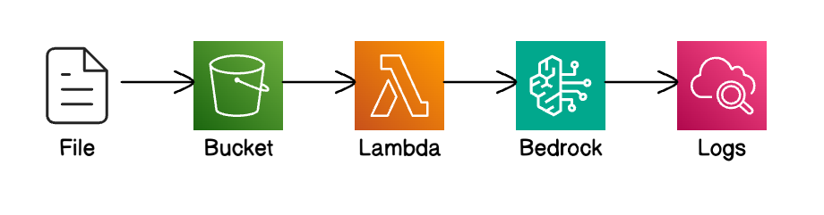

# Lab: Zero shot chat with document

Contributors: [@luiscarlosjayk](https://github.com/luiscarlosjayk)
----

In this lab we showcase how to use [Bedrock RetrieveAndGenerate endpoint](https://docs.aws.amazon.com/bedrock/latest/APIReference/API_agent-runtime_RetrieveAndGenerate.html) to ask questions on single documents hosted in a S3 bucket without the overhead of setting up a vector store, making it frictionless for simple applications.

In this example, we're asking a foundational model to summarize documents uploaded to a S3 bucket.

The prompt used is `Summarize in few sentences the given document.`

## Files

1. [Rust Lambda function](./src/lambda/zero-shot-chat-with-document)
2. [CDK Project](./src/index.ts)
3. [CDK Stack](./src/stack.ts)

## Architecture



## How to Deploy

```bash
#!/bin/bash
pnpm install
cd zero-shot-chat-with-document
pnpm run cdk deploy
```

## How to Run

1. Once deployed you should see a S3 bucket named: `zero-shot-chat-with-document-{generated-id}`
where `{generated-id}` is generated by CDK.

2. Upload a PDF or text file in the S3 bucket, which will trigger the lambda function of similar naming: `zero-shot-chat-with-document`

3. Chech the logs for the given lambda in AWS CloudWatch, which should be named as `/aws/lambda/zero-shot-chat-with-document`

4. Verify the response from the foundational model within logs to have a summary of text uploaded.

For example, if we upload the [MRKL Systems paper](/assets/documents/mrkl-paper-llm-2205.00445.pdf) file from the [assets/documents](/assets/documents) folder, the response in logs obtained was:

> The paper introduces the concept of Modular Reasoning, Knowledge and Language (MRKL) systems, which combine large language models with external knowledge and reasoning modules to overcome the limitations of language models alone. It describes AI21 Labs' implementation of a MRKL system called Jurassic-X and discusses the technical challenges involved, with a focus on how Jurassic-X was trained to handle basic arithmetic operations reliably.


## Inspiration:
1. [Chat with your document using Knowledge Bases for Amazon Bedrock - RetrieveAndGenerate API](https://github.com/aws-samples/amazon-bedrock-samples/blob/ef40813bb878781b9c62447e928fd11f8d343d9f/rag/knowledge-bases/features-examples/00-zero-setup-chat-with-your-document/chat_with_document_kb.ipynb)
